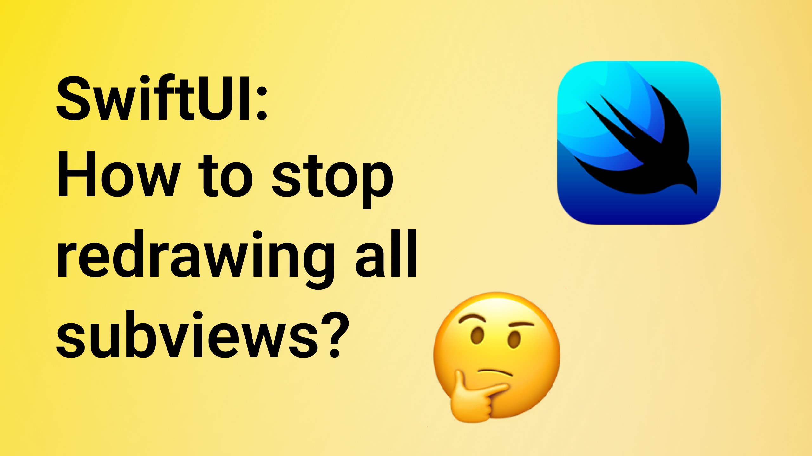

# Prevent SwiftUI from re-rendering views

This is the code from the YT video "Prevent SwiftUI from re-rendering views" 🤗

In this video, you will learn how to prevent SwiftUI from re-rendering a view when two or more views are connected or nested. Enjoy 🤓

## Links:
- [Link to the video](https://www.youtube.com/watch?v=TOmxDvCz7e4)